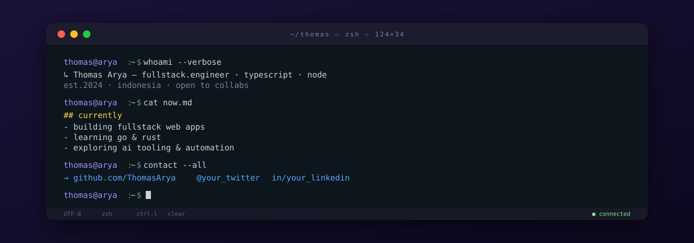
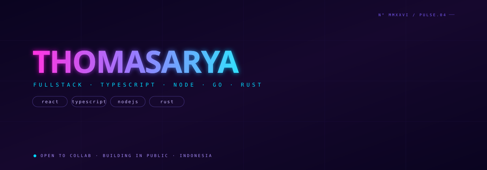

<picture>
  <source media="(prefers-color-scheme: dark)" srcset="./assets/anime.svg">
  
</picture>

 
 

<picture>
  <source media="(prefers-color-scheme: dark)" srcset="./assets/terminal.svg">
  
</picture>

 
 

<picture>
  <source media="(prefers-color-scheme: dark)" srcset="./assets/neon.svg">
  
</picture>

 
 

<picture>
  <source media="(prefers-color-scheme: dark)" srcset="./assets/meteor.svg">
  
</picture>

 
 

 

 

 

 

 
 

 
 

 

<svg width="100%" height="10" viewBox="0 0 1200 10" preserveAspectRatio="none" xmlns="http://www.w3.org/2000/svg">
  <rect x="0" y="3" width="1200" height="4" rx="2" fill="#0D1117">
    <animate attributeName="fill" values="#22D3EE;#A855F7;#22D3EE" dur="4s" repeatCount="indefinite"/>
  </rect>
</svg>

<svg width="400" height="20" viewBox="0 0 400 20" xmlns="http://www.w3.org/2000/svg">
  <text x="200" y="14" text-anchor="middle" fill="#22D3EE" font-size="12" font-family="monospace" opacity="0">
    <animate attributeName="opacity" values="0;1;1;0" dur="4s" repeatCount="indefinite"/>
    THANKS FOR VISITING!
  </text>
</svg>

